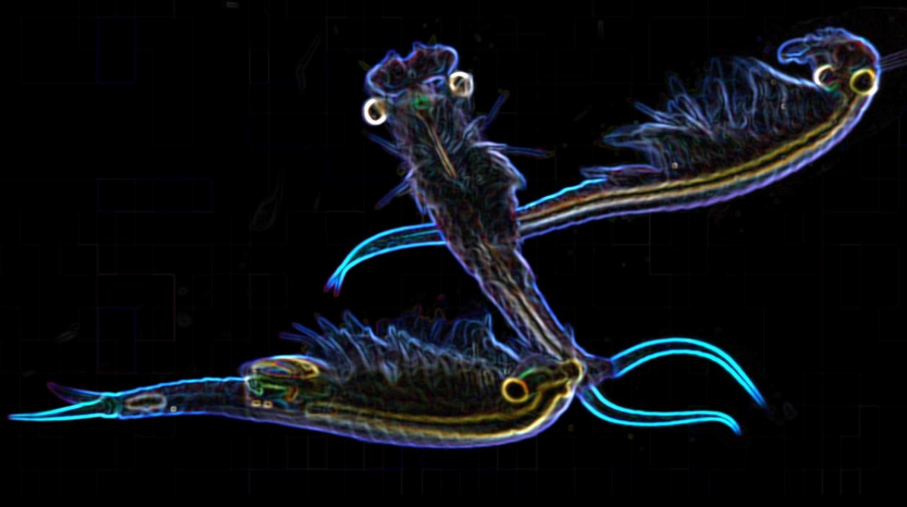

# Climate change impacts on freshwater ecosystems

Aquatic ecosystems are particularly susceptible to climate change. In collaboration with [Tom Pinceel at KU Leuven](https://bio.kuleuven.be/eeb/laeec/whoiswho/00055442) and [Bram Vanschoenwinkel at Vrije Universiteit Brussel](https://insularecology.com/), I've been involved with several studies on the effect of climate change of freshwater ecosystems.

We showed how invertebrates in temporary aquatic habitats are vilnerable to climate change. Not only will ponds be at greater risk of drying, the demographic resilience of species are jeopardised by higher temperatures. This creates a double-wammy for the biodiversity in temproary ponds and wetlands.

From a human perspective, I have also found that rural communities who depend most on wetland ecosystem service tend to be the same people who are degrading these ecosystems. However, they tend to underestimate their own negative impacts, preferring to blame others instead. This creates governance challenges in the sustainable management of communal wetlands. 

* Patshwa, A.O. & **Buschke, F.T.** (2019) Ecosystem services and ecological degradation of communal wetlands in a South African biodi-
versity hotspot. *Royal Society Open Science*,**6**, 181770. ([Link](https://royalsocietypublishing.org/doi/full/10.1098/rsos.181770))
* Pinceel, T., **Buschke, F.T.**, Weckx, M. Brendonck, L. & Vanschoenwinkel, B. (2018) Climate change jeopardizes the persistence of freshwater zooplankton by reducing both habitat suitability and demographic resilience. *BMC Ecology*, **18**,1-9. ([Link](https://bmcecol.biomedcentral.com/articles/10.1186/s12898-018-0158-z))
* Pinceel, T., Vanschoenwinkel, B., Brendonck, L. & **Buschke, F.T.** (2016) Modelling the sensitivity of life history traits to climate change in a temporary pool crustacean. *Scientific Reports*, **6**, 29451. ([Link](https://www.nature.com/articles/srep29451))
* Vanschoenwinkel, B., **Buschke, F.T.** & Brendonck, L. (2013) Disturbance regime alters the impact of dispersal on alpha and beta diversity in a natural metacommunity. *Ecology*, **94**, 2547-2557. ([Link](https://esajournals.onlinelibrary.wiley.com/doi/full/10.1890/12-1576.1))
* **Buschke, F.T.**, Esterhuyse, S., Kemp. M.E., Seaman, M.T., Brendonck, L. & Vanschoenwinkel, B. (2013) The dynamics of mountain rock pools – Are aquatic and terrestrial habitats alternative stable states? *Acta Oecologica*, **47**, 24-29. ([Link](https://www.sciencedirect.com/science/article/pii/S1146609X12001610))

  
