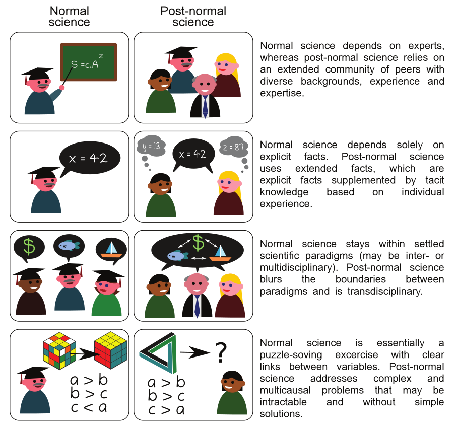
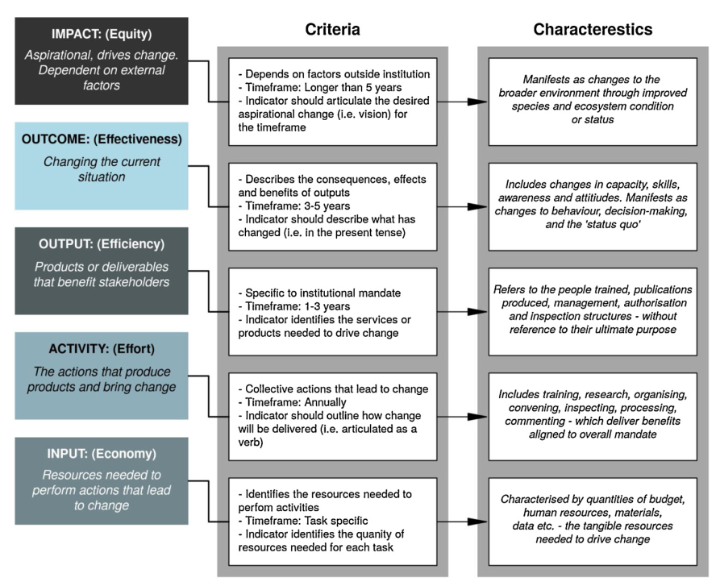

# Novel approaches to conservation implementation

While science is important for evidence-based decision-making, researchers shouldn't assume that their published papers will automatically lead to real-world implementation. That's why I try to pay particular attention to to the best ways of implementing scientific information

## Post-normal conservation science
Post-normal science is used when facts are uncertain, stakes are high, decisions are urgent, and values are disputed. In simple terms, it requires that scientists are not the holders of information, which they pass on to policymakers, stakeholders and practitioners. Instead, scientists are one of many parties to a transdisciplinary negotiation.

<iframe width="560" height="315" src="https://www.youtube.com/embed/8rjfM_LlYZM" frameborder="0" allow="accelerometer; clipboard-write; encrypted-media; gyroscope; picture-in-picture" allowfullscreen></iframe>

* Jarvis, R., Borrelle, S., Forsdick, N., Perez-Hammerle, K., Dubois, N., Recalde-Salas, A., **Buschke, F.**, Rose, D., Archibald, C., Gallo, J., Mair, L., Kadykalo, A., Shanahan, D. & Prohaska, B. (2020) Navigating spaces between conservation research and practice: are we making progress? *Ecological Solutions and Evidence*, **1**, e12028. ([Link](https://besjournals.onlinelibrary.wiley.com/doi/10.1002/2688-8319.12028))
* **Buschke, F.T.**, Botts, E. & Sinclair, S.P. (2019) Post-normal conservation science fills the space between research, policy and implementation. *Conservation Science and Practice*,**1**, e73. ([Link](https://conbio.onlinelibrary.wiley.com/doi/full/10.1111/csp2.73))

## Conservation entrepreneurship
Traditional conservation is funded by governments or by donations. However, recent advances in social entrepreneurship could make it possible for private profit-seeking organisations to contribute to protecting biodiversity. 

That's why I made an effort to introduce the next generation of scientists to the concept of self-started conservation enterprises.

* **Buschke, F.T.** (2015) The startup culture of conservation entrepreneurship. *Conservation Biology*, **29**, 300-302. ([Link](https://conbio.onlinelibrary.wiley.com/doi/abs/10.1111/cobi.12340))

## Monitoring an evaluation
In South Africa, the state of the environment keeps declining despite government departments meeting most of their performance targets. How can this be? In collaborathion with [Pravin Pillay of Ezemvelo KZN Wildlife](https://www.linkedin.com/in/pravin-pillay-2b40462b/?originalSubdomain=za), we showed that this is because government performance targets tend to measure the *actions* of officials, instead of the *outcomes* of their actions. Government monitoring and evaluation will be more effective if it follows a logic model that links actions to outcomes explicitly.

* Pillay, Y.P. & **Buschke, F.T.** (2020) Misaligned environmental governance indicators and the mismatch between government actions and positive environmental outcomes. *Environmental Science & Policy*, **112**, 374-380. ([Link](https://www.sciencedirect.com/science/article/pii/S1462901119315205))

