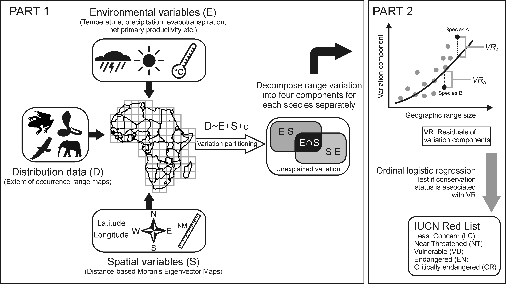
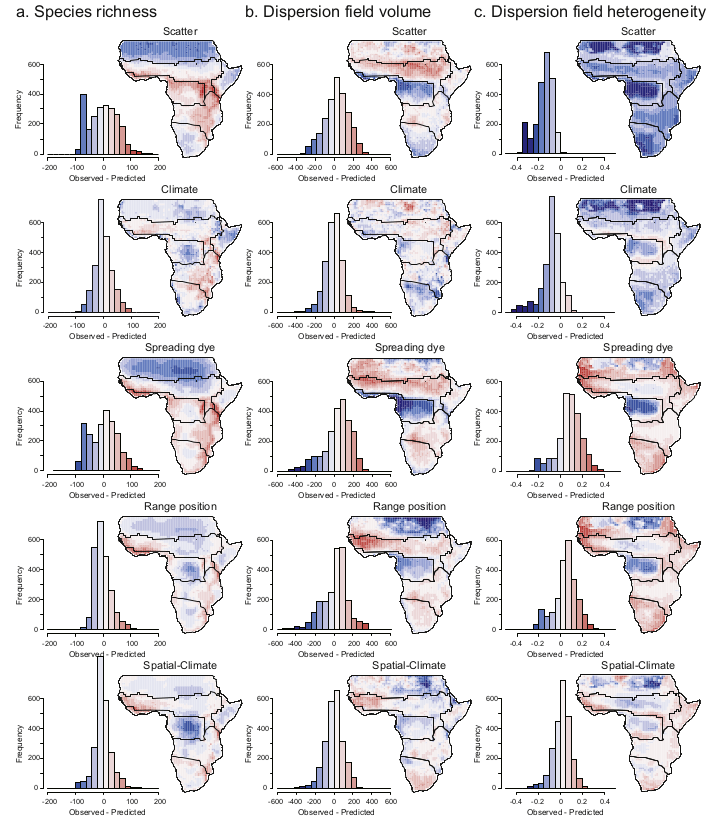

# Macroecology of African vertebrates2

Macroecology is the study of the emergent ecological properties at large spatial and temporal scales. 

My PhD research studied the geographic distribution data of 4,423 species of amphibians, reptiles, birds and mammals for continental Africa and Madagascar. These data were from the [IUCN Red List](https://www.iucnredlist.org/) and [BirdLife International](https://www.birdlife.org/), and were combind with environmental data and custom simulations to explore historical and contemporary range dynamics.

More recently, I am studying whether Modern Coexistence Theory can be applied at large spatial scales. This entails combining trait data of African mammals herbivores, with dietary information from stable isotopes to quantify whether niche differentiation is sufficient to allow for coexistence between competing species.

* Malindie, S., **Buschke, F.T**. & Codron, D. (2020) Carbon isotope differences between grassland and savanna herbivores reveal environmentally driven rather than phylogentically conserved niches. *Journal of Zoology*, **311**, 116-125. ([Link](https://zslpublications.onlinelibrary.wiley.com/doi/abs/10.1111/jzo.12762))
* **Buschke, F.T.**, Brendonck, L. & Vanschoenwinkel, B. (2018) The conservation status of African vertebrates is unrelated to environmental
and spatial patterns in their geographic ranges. *Biodiversity and Conservation*, **27**, 567-582. ([Link](https://link.springer.com/article/10.1007/s10531-017-1449-y))
* **Buschke, F.T.**, Brendonck, L. & Vanschoenwinkel, B. (2016) Adding energy gradients and long-distance dispersal to a neutral model
improves predictions of Madagascan bird diversity. *Ecology and Evolution*, **6**, 6919-6929. ([Link](https://onlinelibrary.wiley.com/doi/full/10.1002/ece3.2379))
* **Buschke, F.T.**, Brendonck, L. & Vanschoenwinkel, B. (2015) Simple mechanistic models can partially explain local but not range-wide
co-occurrence of African mammals. *Global Ecology and Biogeography*, **24**, 762-773. ([Link](https://onlinelibrary.wiley.com/doi/abs/10.1111/geb.12316))
* **Buschke. F.T.**, De Meester, L., Brendonck, L. & Vanschoenwinkel, B. (2015) Partitioning the variation in African vertebrate distributions
into environmental and spatial components - exploring the link between ecology and biogeography. *Ecography*, **38**, 450-461. ([Link](https://onlinelibrary.wiley.com/doi/full/10.1111/ecog.00860))
* **Buschke, F.T.**, Brendonck, L. & Vanschoenwinkel, B. (2014) Differences between regional and biogeographic species pools highlight
the need for multi-scale theories in macroecology. *Frontiers of Biogeography*, **6**, 173-184. ([Link](https://escholarship.org/uc/item/0bp2c1d0))

### Funded by:
* [Erasmus Mundus Action 2 Partnerships scholarship programme](https://www.uantwerpen.be/en/projects/eurosa/about-eurosa/), by the European Commission
