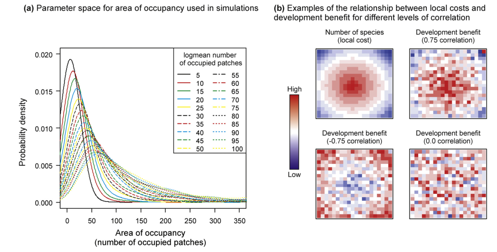
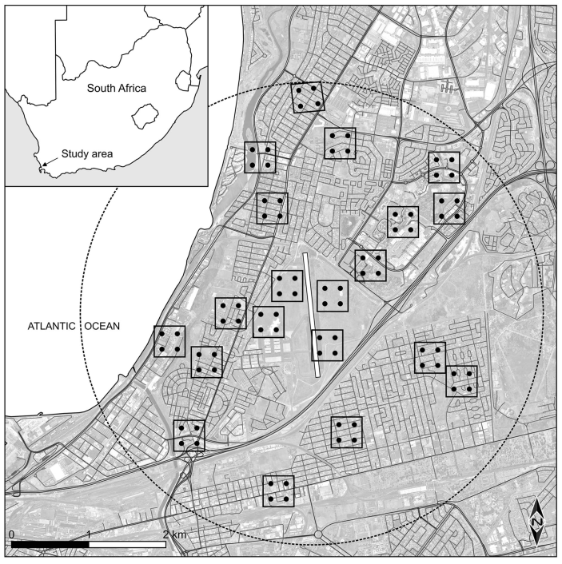

# Mainstreaming biodiversity into infrastructure developments

## The impact of iron mining on biodiversity

I was involved in the biomonitoring of the Anglo American and Kumba Iron Ore [Kolomela Iron Mine](https://www.angloamericankumba.com/our-business/operations) in the southern Kalahari. As part of our work there, I monitored the impact of mining activities on the biodiversity in temporary aquatic wetlands. I was later involved in a book project on the evolution of impacts from iron mines in the region as South African environmental legislation changed over the last 70 years.

* **Buschke, F.T.**,Sommen, J., Seaman, M.T. & Williamson, R.D. (2018) Environmental legislation, mining and Postmasburg’s ecosystems. In: L. Marais, P. Burger and D. van Rooyen (eds.) *Mining and community in South Africa: from small town to iron town*, pp. 121-138. Routledge, London. ([Link](https://books.google.co.za/books?hl=en&lr=&id=JlgPEAAAQBAJ&oi=fnd&pg=PA121&dq=info:cnqVUawN-pkJ:scholar.google.com&ots=dpnrV_y0wl&sig=T-7oqOH8ghUGqD-p24b288eumHM&redir_esc=y#v=onepage&q&f=false))
* **Buschke, F.T.**, Adendorff, J., Lamprechts, J., Watson, M. & Seaman, M.T. (2012) Invertebrates or iron: does large-scale opencast mining impact invertebrate diversity in ephemeral wetlands. *African Zoology*, **47**, 245-254. ([Link](https://www.tandfonline.com/doi/abs/10.1080/15627020.2012.11407549))

## Considering cumulative impacts in development

The impacts of developments do not scale linearly, but can result in cumulative impacts that exceed the sum of individual projects. However, how we choose to account for these cumulative impacts can affect both development and biodiversity. I lead a study with [Bram Vanschoenwinkel from the Vrije Universiteit Brussel](https://insularecology.com/) in which we developed a simulation framework that considered cumulative environmental impacts.

* **Buschke. F.T.** & Vanschoenwinkel, B. (2014)Mechanisms for the inclusion of cumulative impacts in conservation decision-making are sensitive to vulnerability and irreplaceability in a stochastically simulated landscape. *Journal for Nature Conservation*, **22**, 265-271. ([Link](https://www.sciencedirect.com/science/article/pii/S1617138114000181))

## Bird-strike hazard around a military airforce base

I was involved in a  project lead by Rod Jeffery of the South African Department of Defence in which we quanitified the hazard of bird-aircraft collision around Air Force Base Ysterplaat in Cape Town. We showed that urbanisation around the base had changed the composition of bird communities, but that these changes did not change the *risk* or *consequence* of collisions between flying birds and military aircraft. 

* Jeffery, R. & **Buschke, F.T.** (2019) Urbanisation alters bird community composition, but not the hazard of bird-aircraft collision. *Environmental Conservation*, **46**, 124-131. ([Link](https://www.cambridge.org/core/journals/environmental-conservation/article/abs/urbanization-around-an-airfield-alters-bird-community-composition-but-not-the-hazard-of-birdaircraft-collision/F68C15D8AE2E359C59234C6C6C4ADA80))

